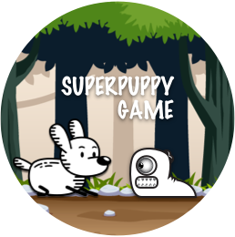

# Super Puppy

## Vanilla JavaScript Canvas Game

[Link to Netlify.com](https://superpower-puppy-game.netlify.app/)

<ins>Game Features:</ins>

- Game Lives – 4
- Game Level – As long as you go!
- Every 10 points your level increases ... more speed more worms to save.

<ins>Developing that game was a learning curve, I have strengthened:</ins>

- Object Oriented Programming (OOP) - Classes and Methods
- Function Parameters and Argument
- Array Prototype and Methods
